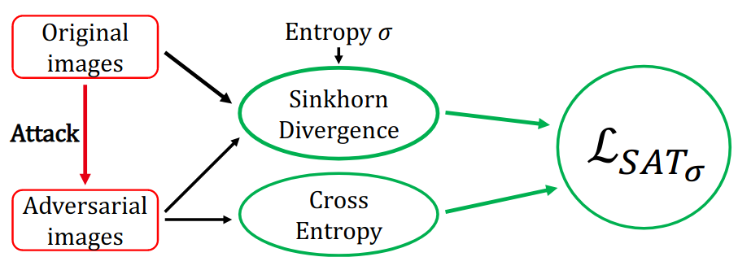
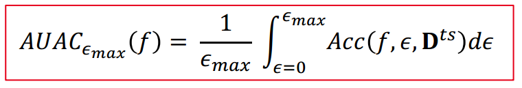

# Optimal Transport as a Defense Against Adversarial Attacks

This repository contains the reference source code for the paper [Optimal Transport as a Defense Against Adversarial Attacks](https://arxiv.org/abs/2102.03156) (ICPR'20). For more information, please check out our paper, our [poster](https://qbouniot.github.io/poster/poster_ICPR2020_QB.pdf) or our [presentation](https://crossminds.ai/video/optimal-transport-as-a-defense-against-adversarial-attacks-6035a52dc390863d8e9c1b1f/).  

We propose a robust adversarial training method based on the latest theory of optimal transport and a new metric for robustness.



## Requirements

- python==3.6+
- pytorch==1.6.0
- advertorch==0.2.0

You can run `conda env create -f environment.yml` to install required packages.

## Train a model with SAT

To train a model with SAT on CIFAR10 use:

```sh
python train.py \
    --dataset 'cifar10' \
    -n 60 \
    --epoch_adv 0 \
    --gpu 0 \
    --arch 'resnet' \
    --sgd \
    --sink \
    --sink_eps 1 \
    -f "resnet_sink1.ckpt" \
    -c "_resnet_sink1"
```

You can use `--dataset 'cifar100'` to train on CIFAR100 and `--arch 'wide'` to train with a WideResnet.

## Evaluate a model against adversarial attacks

To evaluate a model against an adversarial attack use:

```sh
python test_adv.py --arch 'resnet' --dataset 'cifar10' --eps 8 -a PGD -f resnet_sink1.ckpt -l 8 --gpu 0
```

You can choose the norm of the attack with `-l 2` for an $L_2$ norm and `-l 8` for an $L_\infty$ attack.

## Compute AUAC

The AUAC is our proposed metric for robustness. 



To compute AUAC you can use the provided function `compute_auac` in `utils/utils.py`:

```py
from utils.utils import compute_auac

eps_list = [0,1,2,3,4,5]

acc_list = [96, 64.95, 34.52, 16.73, 7.81, 3.73]  
        
print(f"AUAC@5: {compute_auac(eps_list, acc_list)} %")
```

# License

This repository is released under the [CeCILL](LICENSE.txt) license, a free software license
adapted to both international and French legal matters that is fully compatible
with the FSF's GNU/GPL license.

# Citation

If you find this repository useful for your own work, please cite our paper:
- **Optimal Transport as a Defense Against Adversarial Attacks**
Quentin Bouniot, Romaric Audigier, Angélique Loesch. In
*ICPR 2020*.

```
@InProceedings{Bouniot_2021_ICPR,
author = {Bouniot, Quentin and Audigier, Romaric and Loesch, Ang\'{e}lique},
title = {Optimal Transport As a Defense against Adversarial Attacks},
booktitle = {The IEEE 25th International Conference on Pattern Recognition (ICPR'20)},
month = {January},
year = {2021}
}
```